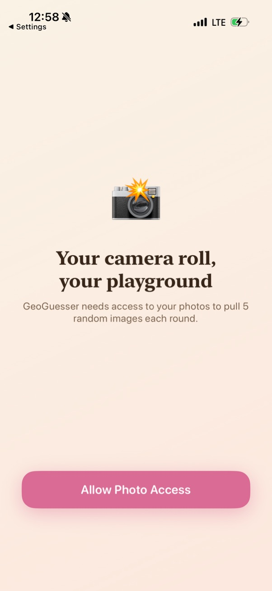
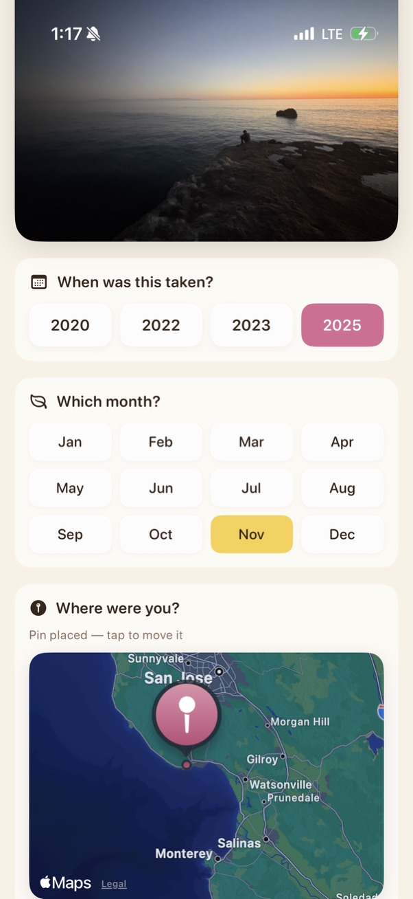
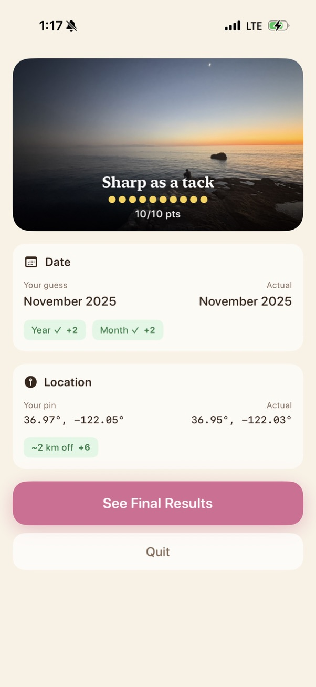

## Why I built this

I take a lot of pictures, but don't revisit them as often, and as a result they fade from memory. However, once I do revisit them the memories come flooding back, and I get to relive the experience all over again, which was the whole point of taking the photo in the first place. 

**How it works:**
Each round, it takes five photos from your camera roll and makes you guess the year, the month, and location the photo was taken. **Review.** After each guess you see how well your recall is. 

  
  
  

## Requirements

Xcode 16 or later. iOS 17 or later. Only photos with both GPS and date metadata are used.
